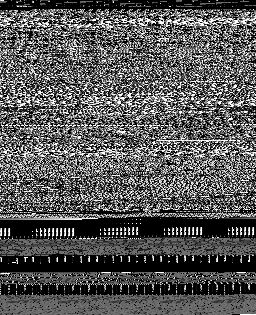
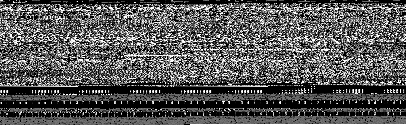
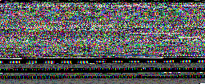
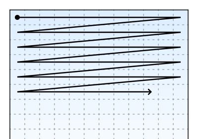
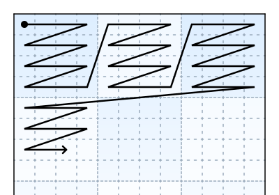
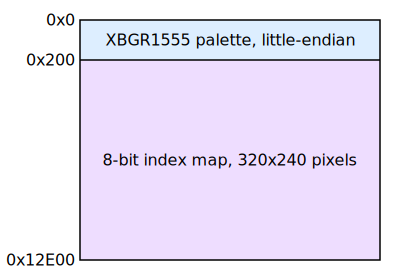

# file2img

[](https://circleci.com/gh/lunasorcery/file2img)

**file2img** is a small utility that can interpret any binary file as image data, in a variety of pixel formats. It's useful for looking at file contents in a visual manner, and for extracting images from old games.

## How do I use it?

### Basic usage

```sh
file2img input.bin
```

This generates a 256px-wide image, mapping each input byte as one pixel, and saves it to the default output path `out.png`. The height is calculated automatically based on the length of the available data.

On the maintainer's MacBook, running it on the file2img binary itself produces this image:




### Specifying width

Depending on your use case, or the size of your input, you may want to look at the data with a different width. This is achieved with `--width` or `-w`.

_Note: The width is specified in pixels, not bytes._

```sh
file2img input.bin -w 512
```

The above command will produce something like this:




### Specifying color formats

By default, **file2img** will render each byte of the file as a single grayscale pixel, mapping the 0-255 range from black to white.
You can render with a different color format using `--format` or `-f`, and you can get a list of all supported formats with `--list-formats` or `-F`.

_Note: Format names are case-insensitive, i.e. `RGB888` and `rgb888` will act the same._

```sh
file2img input.bin -f rgb888
```

The above command will map each pixel to three bytes of the input, treating them as an RGB triplet:




### Specifying input ranges

By default, **file2img** will attempt to read every byte of the specified file.
If you're wanting to look at just a section of a file, this is done with the `--start`/`-s` and `--length`/`-n` flags.

```sh
file2img input.bin -s 128 -n 1024
```

The above command will only read 1024 bytes of the input, starting at an offset 128 bytes into the file.


### Tiled pixel layouts

Some older consoles and computers stored image data in small tiles, as opposed to standard raster order.
**file2img** is able to account for data stored in this fashion, using `--tile` or `-t`.

```sh
file2img input.bin -w 64 -t 8
```

The above command will organise the output pixels into 8x8 tiles, as opposed to using the default raster layout.

_Note: the width must be a multiple of the tile size._

**Standard Raster Layout:**  


**Tiled Layout (4px tiles):**  



### Paletted data

Certain older game platforms often used paletted data - where you'd have a small array of colors, with the image data consisting of indices into that array. With the use of the `--palette-start`/`-p` and `--index-format`/`-i` flags, **file2img** is capable of handling these formats.

Consider a hypothetical file with the following layout. We have a block of little-endian XBGR1555 palette data at address 0x0, and the image's index buffer is 512 bytes later at address 0x200. This layout is very similar to structures you might find in some Game Boy Advance ROMs.



We can render this with the following command:

```sh
file2img input.bin  -f xbgr1555le  -i i8  -p 0  -s $((0x200))  -w 320
```

We specify the _palette's_ color format with `--format`/`-f`, and the _index map_'s format with `--index-format`/`-i`, in this case `i8` for an 8-bit index. We specify the start addresses of the palette and index map with `--palette-start`/`-p` and `--start`/`-s` respectively. Finally, we specify the width.

_Note: Currently, **file2img** can only parse decimal numbers. The `$((hex))` syntax here is for bash to handle the conversion for us._


## Supported formats

_Note: Formats marked with a `*` require a suffix of `BE` or `LE` to specify endianness - for example, BGR565LE for a little-endian BGR565 format._

### Color formats
_These can only be used as inputs to the `--format`/`-f` parameter._

* L1\* (1-bit luminance format)
* L2\* (2-bit luminance format)
* L4\* (4-bit luminance format)
* L8   (8-bit luminance format)
* RGB565\*
* BGR565\*
* ARGB4444\*
* ARGB1555\*
* ABGR1555\*
* XRGB1555\*
* XBGR1555\* (commonly used on the Game Boy Advance)
* RGB888
* BGR888
* ARGB8888
* ABGR8888
* RGBA8888
* BGRA8888
* XRGB8888
* XBGR8888
* RGBX8888
* BGRX8888

### Block formats
_These can only be used as inputs to the `--format`/`-f` parameter, and only when `--index-format`/`-i` isn't in use._

* DXT1       (DXT1 block format)
* DXT5       (DXT5 block format)
* GameBoy    (Game Boy 2-bit tile format)
* NES        (NES 2-bit tile format)

### Index formats
_These can only be used as inputs to the `--index-format`/`-i` parameter._

* i4\*    (4-bit index format)
* i8      (8-bit index format)


## Options:

```
file2img [options] <input file>

-F,--list-formats    Print a list of available formats
-f,--format          Specify the color format (default: L8)
-t,--tile            Specify the tile size (default: 1/disabled)
-w,--width           Specify the target width (default: 256)
-o,--output          Specify the output path (default: out.png)
-s,--start           Specify the start offset (default: 0)
-n,--length          Specify the input byte count (default: all of them)
-i,--index-format    Specify the index map format (default: none)
-p,--palette-start   Specify the palette start offset (default: 0)
```


## Building & Installing

On macOS and Linux, it _should_ be as simple as running the following inside the `file2img` directory:

```
make && make install
```

Windows is not _officially_ supported, but it'll likely work under WSL.
